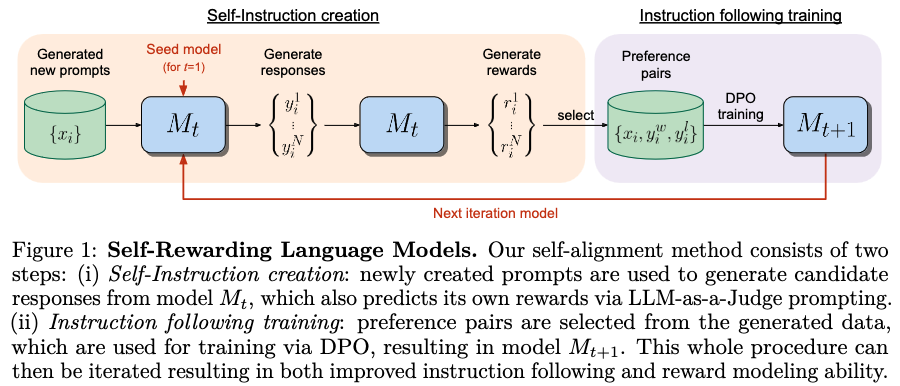

# Self-Rewarding-Language-Models

Paper implementation and adaption of [Self-Rewarding Language Models](https://arxiv.org/abs/2401.10020).



This project explores Self Rewarding Language Models from [Yuan et al., 2024](https://arxiv.org/abs/2401.10020), utilizing LLM-as-a-Judge to allow a model to self-improve. It integrates Low-Rank Adaptation from [Hu et al., 2021](https://arxiv.org/abs/2106.09685) optimizing adaptability without full tuning.

# Installation and Setup

## Run the setup file
```bash
./setup.sh
```
Note: This will create an virtual environment, install the required packages and download the data.

## Configuration
In the `config.yaml` file, you can set the following parameters:
- `cuda_visible_devices`: The GPU to use (0 for first GPU, 1 for second GPU or 0 and 1 for both)
- `model_name`: The name of the model to use. Choose from huggingface hub
- `tokenizer_name`: The name of the tokenizer to use. Choose from huggingface hub
- `wandb_enable`: True or False. If True, logs will be sent to wandb
- `wandb_project`: The name of the wandb project
- `peft_config`: Adapt the PEFT configuration according your needs
- `iterations`: The number of iterations to self improve the model
- `sft_training`: SFT training hyperparameters
- `dpo_training`: DPO training hyperparameters
- `generate_prompts`: The amount of prompts to generate in each iteration
- `generate_responses`: The amount of responses per prompt to generate in each iteration

# Usage
To run the training, execute the following command:
```bash
python -m src.train.train
```


